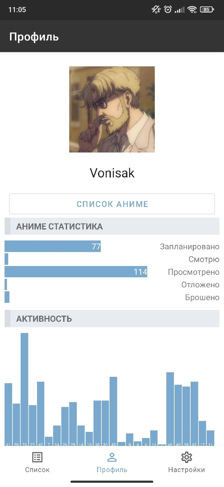
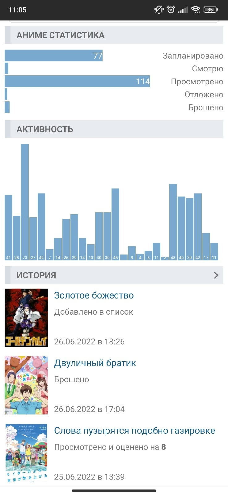
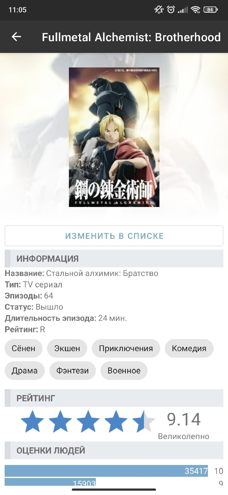
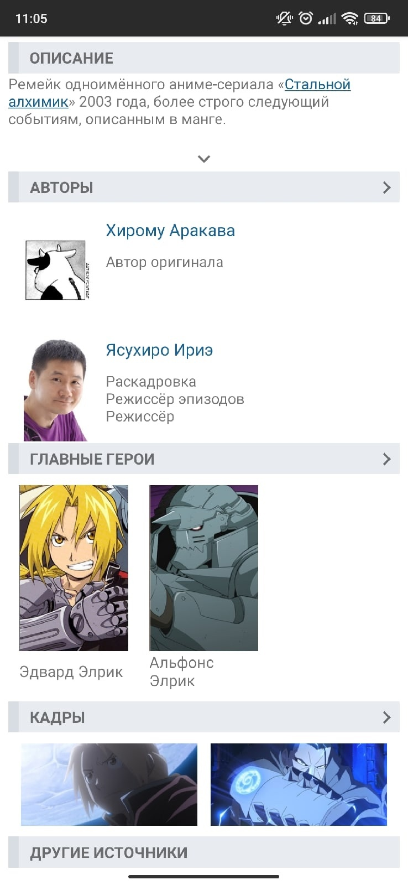

# ShikiDroid
Приложение для просмотра информации о аниме, сделанное с помощью [Shikimori API](https://shikimori.one/api/doc)

На данный момент в приложении есть следующие функции:
- Авторизация
- Просмотр личного профиля
- Редактирование своего списка аниме
- Просмотр главного списка аниме
- Просмотр информации о аниме

 
 
 
 
